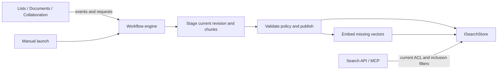

# Search indexing: infrastructure review and implementation

Date: 2026-10-06. Implemented on `feature/search-indexing-workflows`.

## Why search workflows were missing

Search had a backend abstraction but no registered search activities or built-in
workflows. Lists handled item events by writing the index directly; document and
comment writes called reindex directly; stores split text inside upsert; a
recurring embedding job performed provider calls. These paths bypassed durable
workflow runs and could only report indexing failures in transport/job logs.
The original ADR-0043 proposal also kept metadata always on and only disabled
file content, which would leave an excluded library's items searchable.

## Adaptation

The implementation uses the existing workflow engine for all item-processing
reactions. Search adds configurable item indexing, removal, container maintenance
and a bounded rebuild coordinator. The common engine now supports built-ins on
ordinary lists, immutable original item-event context, and completion signals
that connect child runs to durable waits. Other product item-event subscribers
were converted into activities registered as enabled built-in workflows.

List inclusion is independent of automatic execution: disabling automatic
indexing preserves manual runs, whereas exclusion hides all of a list's content
immediately and prevents indexing publication. Status compares current and
published source revisions and includes workflow, content and embedding state.

See [Search](search.md) for API/UI usage and
[ADR-0043](adr/0043-search-indexing-as-workflows-over-a-search-store.md) for
publication guarantees, provider boundaries and remaining tradeoffs.

## Follow-up: cheap and safe system runs

The first implementation exposed engine gaps once every product reaction became a
workflow. These are now closed in the engine and used by search:

| Gap | Engine change |
|---|---|
| Depth limit and folder rule skipped product processes | `System` built-ins start past `MaxDepth` (hard cap 20); `IncludeFolders` |
| Item events could be forged through `event.raise` data | Event kept in the engine-owned execution context; checked against the run's item |
| Core reactions could be turned off or deleted | `Required` built-ins: always on, not copyable, not deletable, not exported |
| Many messages per item edit | Completion events only for listeners and completion kinds; trigger content-type filters |
| Run history growth | Successful system runs kept 24 hours |
| System work queued behind people's workflows | Separate `ResumeSystemRun` queue |
| Hand-rolled fan-out, stopping at one failure, busy-waiting | `WorkflowRequests` (bounded, repeat-safe, tolerant); request completion after all of its runs, `none` when nothing matched |

Search uses cheap stamps for its schedule, page-bounded visibility checks instead
of the caller's whole readable set, scope-only updates on permission changes,
`skipped` outcomes, chunk-size caps and chunk-settings staleness.

